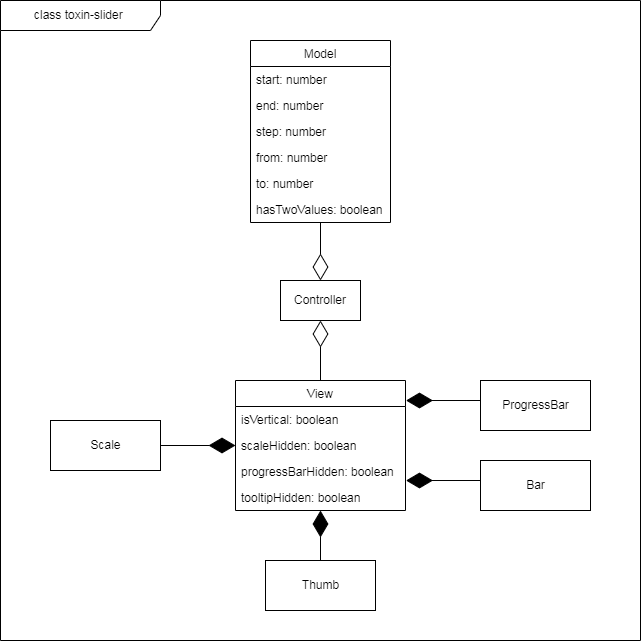

# Плагин слайдера для jQuery

После клонирования репозитория необходимые пакеты устанавливаются стандартной командой `npm install`.

Генерация библиотечных файлов `./dist/toxin-slider.js` и `./dist/toxin-slider.css` производится командой `npm run build`

Запустить dev-сервер с демо-версией слайдера можно
командой `npm start`.

Тесты запускаются командой `npm test`

Пример страницы с демо-слайдером: [TOXIN-слайдер](http://mysecondsite.h1n.ru/).

Использовалась библиотеки **jQuery** версии 3.6.0 и **bignumber.js** версии 9.0.2 

## Применение

Для использования слайдера **необходимо подключить библиотеку jQuery**, библиотечные
файлы `toxin-slider.js` и `toxin-slider.css`. Не рекомендуется использовать классы с префиксом
`toxin-slider`, он использован для компонент слайдера.
```
<!-- Own stylesheet -->
<link href="./toxin-slider.css" rel="stylesheet">
<body>
  ...
  <script defer src="https://code.jquery.com/jquery-3.6.0.js"></script>
  <script defer src="./toxin-slider.js"></script>
  <!-- Own script -->
</body>
```

Для создания слайдера нужно вызвать для jQuery-объекта метод `.toxinSlider()` с
соответствующими параметрами.
```
$('.container').toxinSlider({
  start: 30, // начало шкалы
  end: 50, // конец шкалы
  step: 1, // шаг слайдера
  scaleStep: 5, // шаг шкалы
  from: 32, // положение 1 бегунка по умолчанию 
  to: 41, // положение 2 бегунка по умолчанию
  hasTwoValues: true, // диапазон/одиночный
  thumbsAreRestricted: true, // бегунки ограничивают друг друга
  scaleHidden: true, // видимость шкалы
  tooltipHidden: true, // видимость числа над бегунком
  progressBarHidden: true, // видимость прогресс-бара
  units: '$', // постфикс для чисел шкалы и бегунка
  isVertical: true, // вертикальный/горизонтальный
  name: 'price', // префикс для имён полей ввода
});
```
Каждый из параметров может быть пропущен, в этом случае будет использовано значение по умолчанию.
Для числовых значений: `0`, для булевых: `false`, для `units`: пустая строка, для `name`: `undefined-name`.
Шаг шкалы должен превышать шаг слайдера и нацело на него делиться без остатка. Если шаг шкалы указан некорректно,
или просто не указан, будет использован шаг слайдера. Отображаемый шаг шкалы может превышать
указанный, если размер слайдера на странице браузера достаточно мал,
а количество значений шкалы достаточно велико.

Слайдер займёт 100% ширины или высоты контейнера.

Внутри слайдера будут созданы два числовых поля ввода. Для их имён будет
использован префикс `name`. Если, например, `name === 'price'` поля ввода
будут иметь имена **price-from** и **price-to**, значения в них будут соответствовать
положениям *бегунков*. Если слайдер с одним *бегунком*, будет использовано только
одно поле, ему будет присвоено имя **price**.

Для изменения параметров слайдера нужно повторно вызвать `.toxinSlider()` с новыми параметрами.

Если требуется отслеживать состояние слайдера, нужно настроить обработку
события `toxin-slider.slide`, которое генерирует слайдер при изменении своего состояния.
К данному событию прикрепляется объект, соответствующий интерфейсу `OutsideOptions`, который
содержит все параметры слайдера. Этому же интерфейсу соответствует объект, передаваемый в
метод `.toxinSlider()`. Когда слайдер генерирует событие `toxin-slider.slide`, всем полям в
объекте, имеющим тип `number | string` присваивается значение типа `number`.

```
interface OutsideOptions {
  start?: number | string;
  end?: number | string;
  step?: number | string;
  from?: number | string;
  to?: number | string;
  hasTwoValues?: boolean;
  isVertical?: boolean;
  progressBarHidden?: boolean;
  tooltipHidden?: boolean;
  scaleHidden?: boolean;
  scaleStep?: number | string;
  thumbsAreRestricted?: boolean;
  name?: string;
  units?: string;
}
```

```
function handleSlide(event, { from, to }) {
  console.log(`От ${from} до ${to}`);
}

$('.container').on('toxin-slider.slide', handleSlide);
```

Событие `toxin-slider.slide` также генерируется при создании слайдера, рекомендуется сначала
прикрепить к элементу обработчик, затем создать слайдер, это возможно
сделать цепочкой вызовов.
```
$('.container')
  .on('toxin-slider.slide', handleSlide)
  .toxinSlider({
    start: 30, // начало шкалы
    end: 50, // конец шкалы
    step: 1, // шаг слайдера
    scaleStep: 5, // шаг шкалы
    from: 32, // положение 1 бегунка по умолчанию 
    to: 41, // положение 2 бегунка по умолчанию
    hasTwoValues: true, // диапазон/одиночный
    thumbsAreRestricted: true, // бегунки ограничивают друг друга
    scaleHidden: true, // видимость шкалы
    tooltipHidden: true, // видимость числа над бегунком
    progressBarHidden: true, // видимость прогресс-бара
    units: '$', // постфикс для чисел шкалы и бегунка
    isVertical: true, // вертикальный/горизонтальный
    name: 'price', // префикс для имён полей ввода
  }
);
```

## Архитектура

Плагин добавляет к списку методов jQuery один дополнительный: `.toxinSlider()`.
Метод `.toxinSlider()` создаёт новый слайдер с указанными параметрами внутри jQuery-объекта для которого он был вызван
 (если jQuery-объект содержит более одного html-элемента, слайдер будет создан внутри каждого).
Если слайдер уже существует, к нему будут применены указанные параметры.

Метод `.toxinSlider()` создаёт по одному новому экземпляру классов `Model`, `View`, `Controller`.

### Диаграмма классов



### Класс Model

При создании нового экземпляра указываются параметры,
соответствующие интерфейсу `Options`.
```
interface Options extends OutsideOptions {
  typeMessage: 'options';
}
```

```
const model = new Model({
  typeMessage: 'options',
  start: 12,
  end: 0,
  step: 3,
  from: 9,
  scaleStep: 6,
  tooltipHidden: true,
});
```

При создании и изменении состояния слайдера, числовые значения
нормализуются. Начало и конец шкалы могут быть любыми числовыми значениями,
начало может быть и меньше и больше конца шкалы. Начало и конец шкалы не нормализуются.  
Шаг слайдера не может быть больше, чем модуль разности начала и конца шкалы,
в случае превышения
шагу слайдера присваивается значение модуля разности начала и конца шкалы.
Шаг слайдера не может быть отрицательным, если указать отрицательный шаг,
знак будет отброшен.
Если значение `from` или `to` не соответствует ни одному из делений шкалы, ему присваивается
значение ближайшего.

Состояние *модели* изменяется вызовом публичного метода `update()`,
который вызывается *контроллером* при вводе пользователя или во время выполнения функции
`.toxinSlider()`. Методу передаются параметры, полученные при вводе или переданные в
функцию `.toxinSlider()`, на их основе рассчитываются новые параметры *модели*.

### Класс View

При создании экземпляра *вида* указываются внешняя обёртка, и объект, содержащий внутренние
параметры слайдера (соответствует интерфейсу `SliderState`).
```
interface SliderState {
  start: BigNumber;
  end: BigNumber;
  step: BigNumber;
  from: BigNumber;
  to: BigNumber;
  hasTwoValues: boolean;
  isVertical: boolean;
  progressBarHidden: boolean;
  tooltipHidden: boolean;
  scaleHidden: boolean;
  scaleStep: BigNumber;
  thumbsAreRestricted: boolean;
  name: string;
  units: string;
}
```

```
const view = new View({
  $outerWrapper,
  state: {
    start: new BigNumber(14),
    end: new BigNumber(114),
    step: new BigNumber(25),
    from: new BigNumber(39),
    to: new BigNumber(64),
    isVertical: true,
    hasTwoValues: true,
    progressBarHidden: false,
    tooltipHidden: false,
    scaleHidden: false,
    scaleStep: new BigNumber(25),
    thumbsAreRestricted: false,
    name: 'test',
    units: 'mm.',
  }
});
```

При инициализации *вида* создаются 2 экземпляра *бегунка*, экземпляр *шкалы*,
экземпляр *прогресс-бара* и экземпляр *направляющей* (Bar),
которым передаются соответствующие параметры *модели*.

Обновление *вида* происходит при вызове *контроллером* публичного метода `update()`,
которому передаются новые параметры слайдера, тот в свою очередь обновляет состояние 
*бегунков*, *шкалы*, *прогресс-бара*, *направляющей* и полей ввода.

### Класс Controller

При создании экземпляра *контроллера*, указываются конкретные экземпляры *вида*
и *модели*.
```
const controller = new Controller({ model, view });
```
К jQuery-объекту данного экземпляра *вида* прикрепляется обработчик
события `toxin-slider.update`. Это событие генерируется при
вводе пользователя или вызове метода `.toxinSlider()`. Обработчик события `toxin-slider.update`
изменяет состояние *модели*, используя данные события, затем вызывает обновление
*вида*, передавая виду состояние обновлённой модели. Также *контроллер* генерирует событие `toxin-slider.slide`, которое позволяет извне
отслеживать состояние слайдера.
