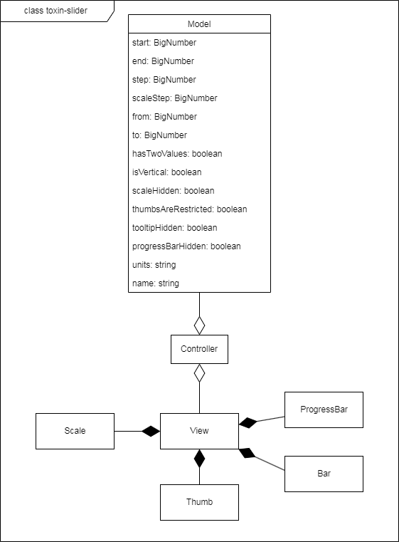

# Плагин слайдера для jQuery

После клонирования репозитория необходимые пакеты устанавливаются стандартной командой `npm install`.

Генерация библиотечных файлов `./dist/toxin-slider.js` и `./dist/toxin-slider.css` производится командой `npm run build`

Запустить dev-сервер с демо-версией слайдера можно
командой `npm start`.

Тесты запускаются командой `npm test`

Пример страницы с демо-слайдером: [TOXIN-слайдер](http://mysecondsite.h1n.ru/).

Использовалась библиотека **jQuery** версии 3.6.0.

## Применение

Для использования слайдера **необходимо подключить библиотеку jQuery**, библиотечные
файлы `toxin-slider.js` и `toxin-slider.css`. Не рекомендуется использовать классы с префиксом
`toxin-slider`, он использован для компонент слайдера.
```
<script src="https://code.jquery.com/jquery-3.6.0.js"></script>
<script src="./toxin-slider.js"></script>
<link href="./toxin-slider.css" rel="stylesheet">
```

Для создания слайдера нужно вызвать для jQuery-объекта метод `.toxinSlider()` с
соответствующими параметрами.
```
$('.container').toxinSlider({
  start: 30, // начало шкалы
  end: 50, // конец шкалы
  step: 5, // шаг шкалы
  from: 35, // положение 1 бегунка по умолчанию 
  to: 40, // положение 2 бегунка по умолчанию
  hasTwoValues: true, // диапазон/одиночный
  scaleHidden: true, // видимость шкалы
  tooltipHidden: true, // видимость числа над бегунком
  progressBarHidden: true, // видимость прогресс-бара
  units: '$', // постфикс для чисел шкалы и бегунка
  isVertical: true, // вертикальный/горизонтальный
  name: 'price', // префикс для имён полей ввода
});
```

Слайдер займёт 100% ширины или высоты контейнера.

Внутри слайдера будут созданы два числовых поля ввода. Для их имён будет
использован префикс `name`. Если, например, `name === 'price'` поля ввода
будут иметь имена **price-from** и **price-to**, значения в них будут соответствовать
положениям *бегунков*. Если слайдер с одним *бегунком*, будет использовано только
одно поле **price-from**.

Для изменения параметров слайдера нужно повторно вызвать `.toxinSlider()` с новыми параметрами.

Если требуется отслеживать состояние слайдера, нужно настроить обработку
события `toxin-slider.slide`, которое генерирует слайдер при изменении своего состояния.
К данному событию прикрепляется объект, соответствующий интерфейсу `ViewState`, который
содержит все параметры слайдера.
```
function handleSlide(event, { from, to }) {
  console.log(`От ${from} до ${to}`);
}

$('.container').on('toxin-slider.slide', handleSlide);
```

Событие `toxin-slider.slide` также генерируется при создании слайдера, рекомендуется сначала
прикрепить к элементу обработчик, затем создать слайдер, это возможно
сделать цепочкой вызовов.
```
$('.container')
  .on('toxin-slider.slide', handleSlide)
  .toxinSlider({
    start: 30, // начало шкалы
    end: 50, // конец шкалы
    step: 5, // шаг шкалы
    from: 35, // положение 1 бегунка по умолчанию 
    to: 40, // положение 2 бегунка по умолчанию
    hasTwoValues: true, // диапазон/одиночный
    scaleHidden: true, // видимость шкалы
    tooltipHidden: true, // видимость числа над бегунком
    progressBarHidden: true, // видимость прогресс-бара
    units: '$', // постфикс для чисел шкалы и бегунка
    isVertical: true, // вертикальный/горизонтальный
    name: 'price', // префикс для имён полей ввода
  }
);
```

## Архитектура

Плагин добавляет к списку методов jQuery один дополнительный: `.toxinSlider()`.
Метод `.toxinSlider()` создаёт новый слайдер с указанными параметрами внутри jQuery-объекта для которого он был вызван
 (если jQuery-объект содержит более одного html-элемента, слайдер будет создан внутри каждого).
Если слайдер уже существует, к нему будут применены указанные параметры.

Метод `.toxinSlider()` создаёт по одному новому экземпляру классов `Model`, `View`, `Controller`.

### Диаграмма классов



### Класс Model

При создании нового экземпляра указываются начало, конец и шаг шкалы;
формат слайдера - одиночный бегунок или диапазон, ограниченный двумя бегунками;
начальные границы диапазона. Эти данные соответствуют интерфейсу `ModelState`. В формате "одиночный бегунок" используется одно значение `from`.
```
interface ModelState {
  start?: number;
  end?: number;
  step?: number;
  from?: number;
  to?: number;
  hasTwoValues?: boolean;
}
```
```
const model = new Model({
  start: 0,
  end: 10,
  step: 1,
  from: 3,
  to: 7,
  hasTwoValues: true,
});
```

При создании и изменении состояния слайдера, числовые значения
нормализуются. Начало и конец шкалы могут быть любыми числовыми значениями,
начало может быть и меньше и больше конца шкалы. Начало и конец шкалы не нормализуются.  
Модуль шага шкалы не может быть больше, чем модуль разности начала и конца, в случае превышения
шагу шкалы присваивается разность начала и конца шкалы.
Если знак шага не соответствует шкале (шкала убывающая, а шаг положительный,
или шкала возрастающая, а шаг отрицательный), знак меняется на противоположный.
Если значение `from` или `to` не соответствует ни одному из делений шкалы, ему присваивается
значение ближайшего.

Состояние *модели* изменяется вызовом публичного метода `update()`,
который вызывается *контроллером* при вводе пользователя или во время выполнения функции
`.toxinSlider()`. Методу передаются параметры, полученные при вводе или переданные в
функцию `.toxinSlider()`, на их основе рассчитываются новые параметры *модели*.

### Класс View

При создании экземпляра *вида* указываются внешняя обёртка, видимость *шкалы*, *прогресс-бара*, числа над *бегунком*,
вертикальная/горизонтальная ориентация слайдера и параметры *модели*, на основе которых *вид* будет
рассчитывать положение *бегунков* и параметры
*шкалы* (начало, конец, шаг) для их отображения. Если *модель* в формате "одиночный бегунок", *вид*
будет отображать только один *бегунок*, иначе оба.
```
interface ViewState extends ModelState {
  isVertical?: boolean;
  progressBarHidden?: boolean;
  tooltipHidden?: boolean;
  scaleHidden?: boolean;
  units?: string;
  name?: string;
}
```
```
  const view = new View({
    state: {
      start: 14,
      end: 102,
      step: 5,
      from: 19,
      to: 24,
      hasTwoValues: false,
      isVertical: true,
      progressBarHidden: false,
      tooltipHidden: false,
      scaleHidden: false,
      units: 'mm.',
      name: 'example-slider',
    },
    $outerWrapper: $('.js-container'),
  });
```

`units` - это строка, которая дописывается к числам шкалы и числу над бегунком,
по умолчанию пустая строка.

Внутри слайдера будут созданы два числовых поля ввода. Для их имён будет
использован префикс `name`. Если, например, `name === 'price'` поля ввода
будут иметь имена **price-from** и **price-to**, значения в них будут соответствовать
*модели*.

При инициализации *вида* создаются 2 экземпляра *бегунка*, экземпляр *шкалы*,
экземпляр *прогресс-бара* и экземпляр *направляющей* (Bar), которым передаются соответствующие параметры *вида* и *модели*.

Обновление *вида* происходит при вызове *контроллером* публичного метода `update()`,
которому передаются новые параметры *вида*, тот в свою очередь обновляет состояние 
*бегунков*, *шкалы*, *прогресс-бара*, *направляющей* и полей ввода.

### Класс Controller

При создании экземпляра *контроллера*, указываются конкретные экземпляры *вида*
и *модели*. К jQuery-объекту данного экземпляра *вида* прикрепляется обработчик
события `toxin-slider.update`. Это событие генерируется при
вводе пользователя или вызове функции `.toxinSlider()`. Обработчик события `toxin-slider.update`
изменяет состояние *модели*, используя данные события, затем вызывает обновление
*вида*. Также *контроллер* генерирует событие `toxin-slider.slide`, которое позволяет извне
отслеживать состояние слайдера.
